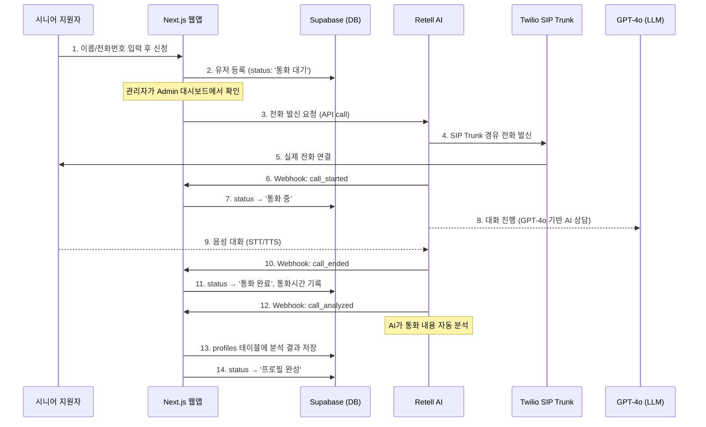

# SAI PLUS — AI 시니어 캐스팅 서비스 아키텍처 개요

## 서비스 한 줄 요약

> 중장년 시니어가 웹사이트에 이름/전화번호를 등록하면, **AI 상담원이 자동으로 전화**를 걸어 대화를 통해 이력 정보를 수집하고, 그 결과를 **AI가 분석**하여 프로필 데이터로 만들어주는 서비스.

---

## 전체 플로우 다이어그램

---

## 기술 스택

| 영역 | 기술 | 역할 |
|------|------|------|
| **프론트엔드** | Next.js 16 + React 19 | 웹 랜딩페이지 & 관리자 대시보드 |
| **스타일링** | TailwindCSS + Framer Motion | UI 스타일링 & 애니메이션 |
| **전화 발신** | **Retell AI** + **Twilio SIP Trunk** | AI 전화 발신/수신 인프라 |
| **AI 상담원** | **Retell AI Agent** (GPT-4o 기반) | 시니어와 대화하는 AI 상담원 |
| **음성 처리** | Retell AI 내장 (STT/TTS) | 음성↔텍스트 변환 |
| **통화 분석** | Retell AI Post-Call Analysis | 통화 후 자동 데이터 추출 |
| **데이터베이스** | **Supabase** (PostgreSQL) | 유저/프로필 데이터 저장 |
| **배포** | Vercel | Next.js 앱 호스팅 |

---

## 핵심 서비스 상세 설명

### 1. 전화 발신 — Retell AI + Twilio SIP Trunk

- **전화 API**: [Retell AI SDK](https://www.retellai.com/) (`retell-sdk`)를 사용
- 전화 발신 시 `retell.call.createPhoneCall()` 메서드 호출
- **발신 번호**: `+12565781774` (Twilio에 등록된 SIP Trunk 번호, 미국 번호)
- **수신 번호**: 한국 전화번호를 E.164 형식 (`+82...`)으로 변환하여 발신
- Retell AI가 내부적으로 **Twilio SIP Trunk**를 경유하여 실제 전화를 연결

### 2. AI 상담원 — Retell AI Agent (GPT-4o)

- **엔진**: Retell AI의 `retell-llm` Response Engine, 내부적으로 **GPT-4o** 사용
- **음성**: ElevenLabs 음성 (`11labs-Adrian`)
- **언어**: 한국어 (`ko-KR`)
- **상담원 이름**: "실버 캐스팅 알리미"
- **역할**: 중장년층에게 친절하게 경력/현재상황/필요사항을 질문
- **안전장치**:
  - 최대 통화 시간: 6분 (`max_call_duration_ms: 360000`)
  - 침묵 시 자동 종료: 15초 (`end_call_after_silence_ms: 15000`)
  - 프롬프트 내 4분 30초 경과 시 자연스럽게 마무리하도록 지시

### 3. 통화 후 분석 — Post-Call Analysis

Retell AI가 통화 종료 후 자동으로 대화 내용을 분석하여 다음 6가지 항목을 추출:

| 항목 | 설명 |
|------|------|
| `career_summary` | 과거 경력/직무/근무기간 요약 |
| `current_situation` | 현재 상황, 희망 근무형태 |
| `needs` | 필요사항/걱정되는 부분 |
| `sentiment` | 대화 감정 톤 (긍정적/차분/불안/무뚝뚝) |
| `personality_traits` | 성격적 장점 분석 |
| `spelling_corrected_notes` | 핵심 내용 글머리 기호 요약 |

---

## API 라우트 구조

### `/api/register` — 지원자 등록
- 웹 랜딩페이지에서 이름/전화번호 제출 시 호출
- Supabase `users` 테이블에 저장 (status: `통화 대기`)

### `/api/call` — AI 전화 발신
- Admin 대시보드에서 "전화 걸기" 버튼 클릭 시 호출
- Retell AI SDK로 전화 발신 → DB status를 `전화 발신됨`으로 업데이트

### `/api/webhook` — Retell AI 웹훅 수신
- Retell AI가 통화 상태 변경 시 자동으로 호출
- 처리하는 이벤트:
  - `call_started` → status를 `통화 중`으로 업데이트
  - `call_ended` → status를 `통화 완료`/`통화 실패`로 업데이트 + 통화시간 기록
  - `call_analyzed` → AI 분석 결과를 `profiles` 테이블에 저장 → status를 `프로필 완성`으로 업데이트

---

## DB 스키마 (Supabase)

### `users` 테이블
| 컬럼 | 설명 |
|------|------|
| `id` | UUID (PK) |
| `name` | 지원자 이름 |
| `phone` | 전화번호 |
| `status` | 현재 상태 (`통화 대기` → `전화 발신됨` → `통화 중` → `통화 완료` → `프로필 완성`) |
| `call_initiated_at` | 전화 발신 시간 |
| `call_duration_seconds` | 실제 통화 시간 (초) |
| `disconnection_reason` | 통화 종료 사유 |

### `profiles` 테이블
| 컬럼 | 설명 |
|------|------|
| `user_id` | users 테이블 FK |
| `full_transcript` | 전체 통화 녹취 텍스트 (STT) |
| `career_summary` | 경력 요약 |
| `current_situation` | 현재 상황 |
| `needs` | 필요사항 |
| `sentiment` | 감정 분석 |
| `personality_traits` | 성격 분석 |
| `spelling_corrected_notes` | 핵심 요약 노트 |

---

## 페이지 구성

| 경로 | 용도 |
|------|------|
| `/` (page.tsx) | **랜딩페이지** — 서비스 소개 + 지원 신청 폼 |
| `/admin` (admin/page.tsx) | **관리자 대시보드** — 지원자 목록, AI 전화 발신 버튼, 프로필 상세 보기 (5초 폴링) |
